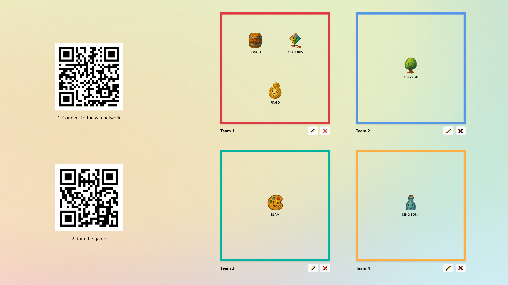
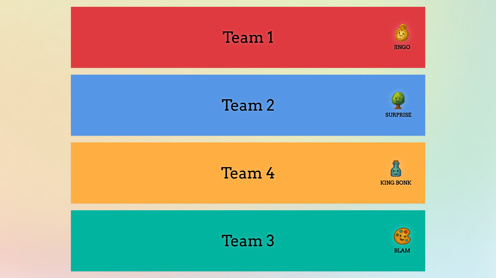
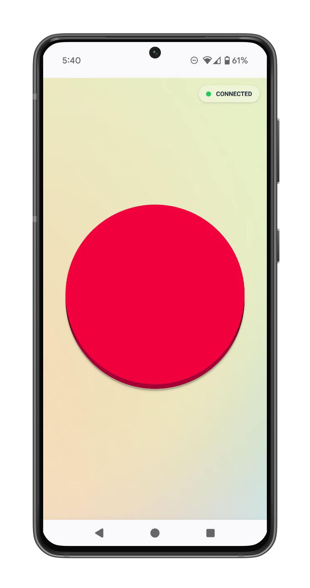
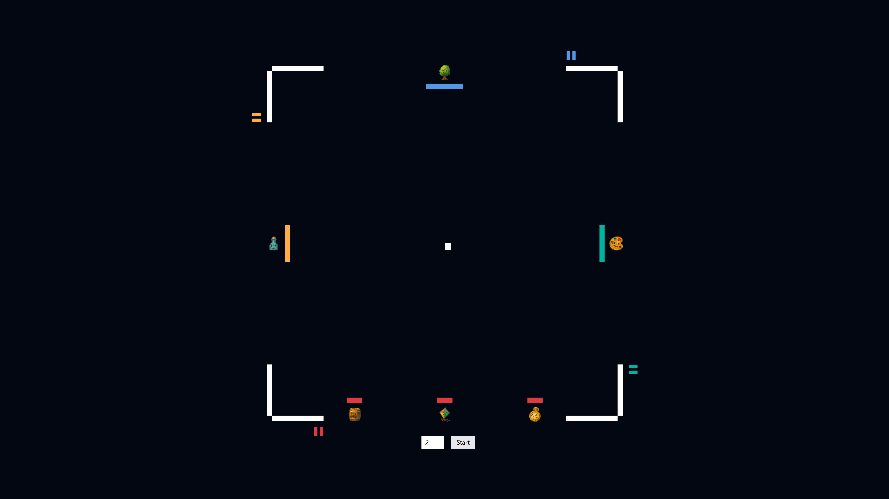
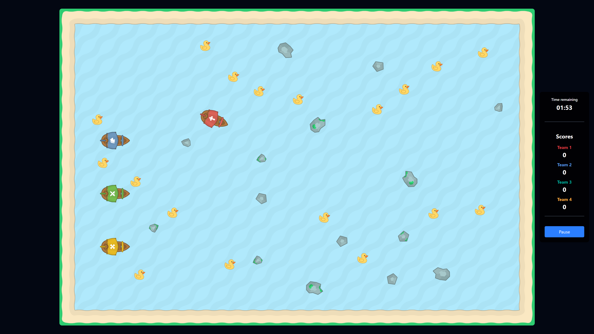
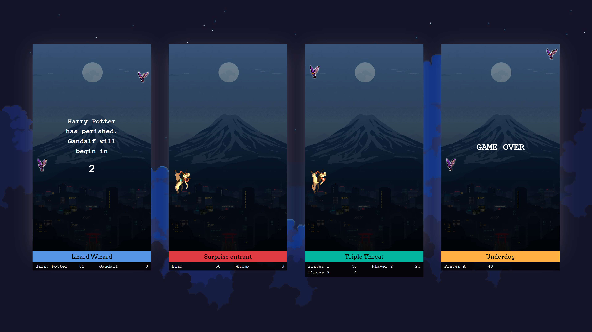
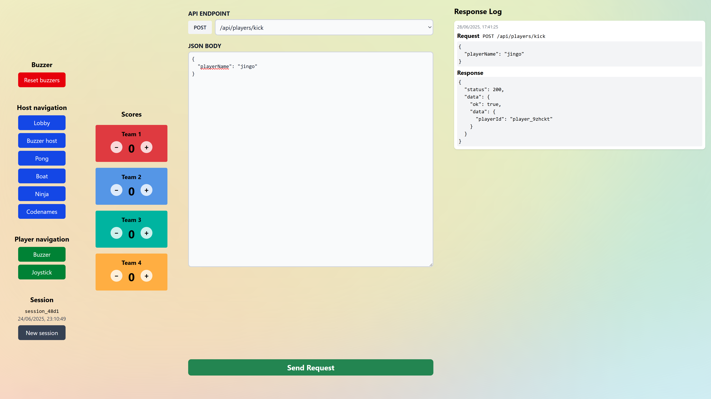

# Arcade

Arcade is an application to help run game nights at home that supports up to 24 players divided into 2-4 teams. Each player uses their phone as a controller, connecting via your local WiFi network.



## Table of contents
- [Arcade](#arcade)
  - [Table of contents](#table-of-contents)
  - [Features](#features)
    - [Buzzer rounds](#buzzer-rounds)
    - [Multiplayer arcade games](#multiplayer-arcade-games)
  - [Installation \& setup](#installation--setup)
    - [Prerequisites](#prerequisites)
    - [Instructions](#instructions)
  - [Admin controls](#admin-controls)

## Features

> [!NOTE]
> This project does not have production-grade security. I use it to host game nights for friends. You shouldn't expose this to the internet.

### Buzzer rounds
See who can buzz in first to answer questions.

<table>
  <tr>
    <td width="78%"></td>
    <td width="5%"></td>
    <td width="22%"></td>
  </tr>
</table>

### Multiplayer arcade games

**Pong**

Classic pong, but each player controls a mini-paddle.



**Boat game**

Collect the most ducks before time runs out.



**Ninja run**

Avoid obstacles as the course speeds up.




## Installation & setup

### Prerequisites
- The [Bun](https://bun.sh) javascript runtime
- A computer to run the server
- A WiFi network connection, ideally one that lets you set up a static IP address for the server computer
- A display device (TV/projector) for the main game screen
- Mobile phones for players

### Instructions
1. **Clone and install dependencies**

   ```bash
   git clone https://github.com/kabirgh/arcade.git
   cd arcade
   bun install
   ```

1. **Set up configuration**

   Update `config.ts` with your WiFi credentials and server IP address. This is used to generate QR codes that players can scan to connect to the WiFi and join the game.

1. **Start the server**

   Use `bun prod` to compile and start the application.

   If you're editing the code, you can start the server with `bun dev`. This starts the application with hot reloading.

1. **Connect devices**
  Display the main game on your TV at `http://{server.host}:{server.port}`. Players can join by scanning the QR code on the screen.

1. **Navigate between screens using the admin controls**

   Open the admin panel on your main display at `http://{server.host}:{server.port}/admin` to use the admin controls.

## Admin controls



The admin panel is a web interface that allows you to navigate between screens and manage game flow. You can:
- Navigate between screens
- Reset buzzer presses
- Track team scores
- Start a new session, which kicks all players and resets scores
- Make any API call to the server. The most useful are:
  - `POST /api/players/kick` - Kick a player from the game
  - `POST /api/websocket/send-message` - Send a websocket message
    - Set how quickly ducks appear on screen in boat game with the `GAME/DUCK_SPAWN_INTERVAL` message
    - Add more time to the boat game timer with the `GAME/BOAT_ADD_TIME` message
