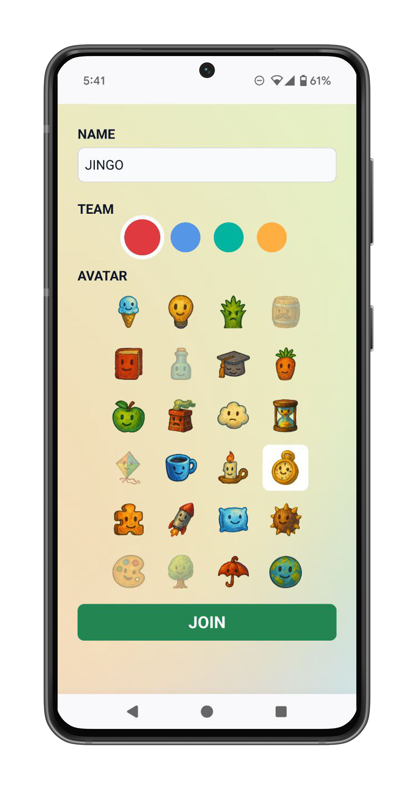

# Arcade

Arcade is an application to help you run a game night for up to 24 players in 2-4 teams.


Players use their phone to press a big red button to buzz in to answer quiz questions (questions not provided) or move a joystick for arcade games (games are provided).

<table>
  <tr>
    <td width="33%" align="center"></td>
    <td width="33%" align="center"></td>
    <td width="33%" align="center"></td>
  </tr>
</table>

## Table of contents
- [Arcade](#arcade)
  - [Table of contents](#table-of-contents)
  - [Features](#features)
    - [Buzzer rounds](#buzzer-rounds)
    - [Multiplayer arcade games](#multiplayer-arcade-games)
  - [Installation \& setup](#installation--setup)
    - [Prerequisites](#prerequisites)
    - [Local mode setup](#local-mode-setup)
    - [Internet mode setup (remote play)](#internet-mode-setup-remote-play)
  - [Admin controls](#admin-controls)

## Features

### Buzzer rounds
See who can buzz in first to answer questions.


### Multiplayer arcade games

**Pong**

Classic pong, except each player controls a mini-paddle using their joystick.


**Boat game**

Collect the most ducks before time runs out. The boat goes in the average direction of all the players' joystick movements.


**Ninja run**

Avoid obstacles as the course speeds up. Players press the big red button to jump from one side of the screen to the other. After one player dies to an obstacle, the next player on the team starts.


## Installation & setup

### Prerequisites
- The [Bun](https://bun.sh) javascript runtime
- A computer to run the server
- A display device (TV/projector) for the main game screen
- Mobile phones for players

**For local mode (LAN game nights):**
- A WiFi network connection, ideally one that lets you set up a static IP address for the server computer

**For internet mode (remote play):**
- A VPS or cloud server with a public IP
- A domain name pointing to your server
- TLS certificates (free from Let's Encrypt)

### Local mode setup

1. **Clone and install dependencies**

   ```bash
   git clone https://github.com/kabirgh/arcade.git
   cd arcade
   bun install
   ```

1. **Set up configuration**

   Update `config.ts` with your WiFi credentials and server IP address. This is used to generate QR codes that players can scan to connect to the WiFi and join the game.

   ```typescript
   mode: "local",
   wifi: {
     ssid: "YourWiFiName",
     password: "YourWiFiPassword",
   },
   server: {
     host: "192.168.1.xxx", // Your server's local IP
     port: 3001,
   },
   ```

1. **Start the server**

   Use `bun prod` to compile and start the application.

   If you're editing the code, you can start the server with `bun dev`. This starts the application with hot reloading.

1. **Connect devices**

   Display the main game on your TV at `http://{server.host}:{server.port}`, where host and port are the values from `config.ts`. Players can join by scanning the QR code on the screen.

1. **Navigate between screens using the admin controls**

   Open the admin panel on your main display at `http://{server.host}:{server.port}/admin` to use the admin controls.

### Internet mode setup (remote play)

1. **Clone and install dependencies** (same as local mode)

1. **Obtain TLS certificates**

   Use Let's Encrypt with certbot to get free certificates:
   ```bash
   sudo certbot certonly --standalone -d arcade.yourdomain.com
   ```

   Copy the certificates to your project:
   ```bash
   mkdir certs
   sudo cp /etc/letsencrypt/live/arcade.yourdomain.com/fullchain.pem ./certs/
   sudo cp /etc/letsencrypt/live/arcade.yourdomain.com/privkey.pem ./certs/
   sudo chown $USER ./certs/*.pem
   ```

1. **Update configuration for internet mode**

   ```typescript
   mode: "internet",
   internet: {
     domain: "arcade.yourdomain.com",
     port: 443,
     tls: {
       certPath: "./certs/fullchain.pem",
       keyPath: "./certs/privkey.pem",
     },
   },
   ```

1. **Start the server**

   ```bash
   bun prod
   ```

   Note: Port 443 may require root privileges. You can either:
   - Run with `sudo bun prod`
   - Use a higher port (e.g., 8443) and set up a reverse proxy
   - Use `setcap` to allow Bun to bind to port 443

1. **Connect devices**

   Share your URL (`https://arcade.yourdomain.com`) with friends. They can open it directly or scan the QR code on the lobby screen.

## Admin controls


The admin screen allows you to manage game flow. You can:
- Navigate between screens on the main display
- Reset buzzer presses
- Track team scores
- Start a new session, which kicks all players and resets scores
- Make any API call to the server. The most useful are:
  - `POST /api/players/kick` - Kick a player from the game
  - `POST /api/websocket/send-message` + `GAME/DUCK_SPAWN_INTERVAL` - Set how quickly ducks appear on screen in boat game
  - `POST /api/websocket/send-message` + `GAME/BOAT_ADD_TIME` - Add more time to the boat game timer
